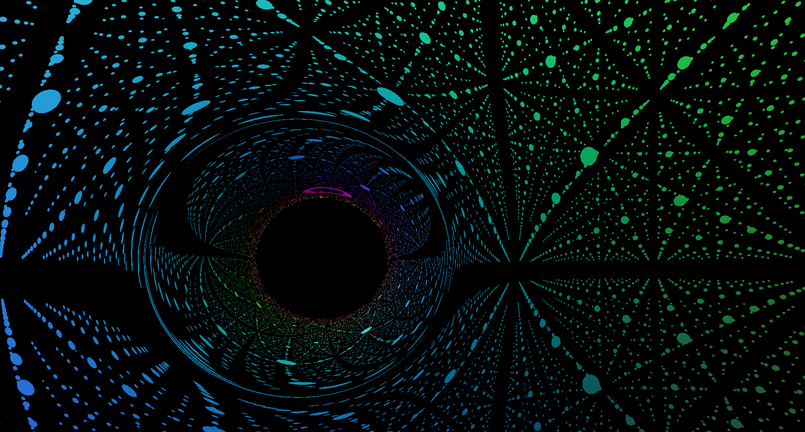
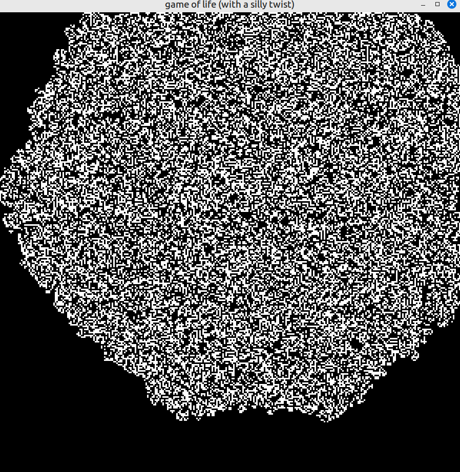
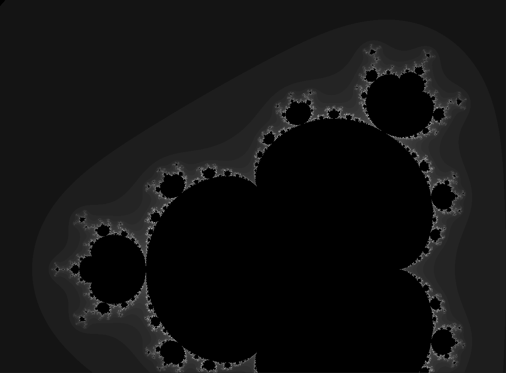
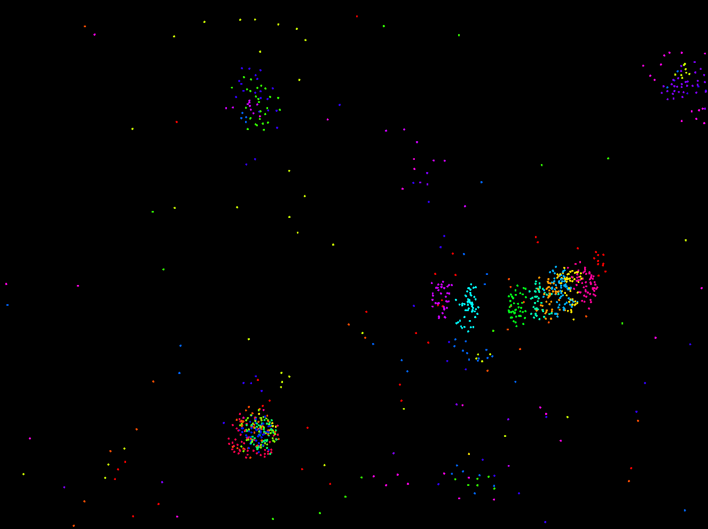
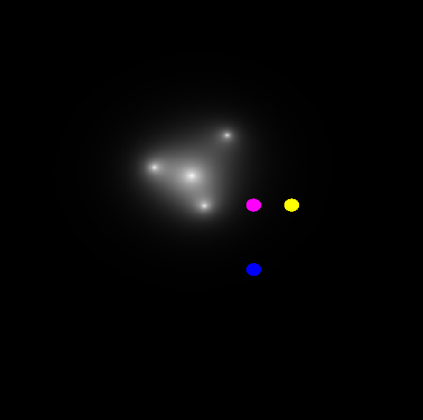
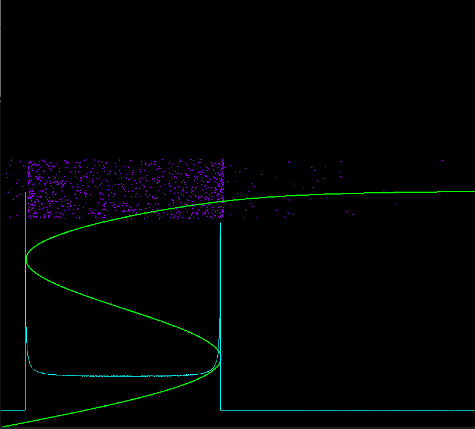
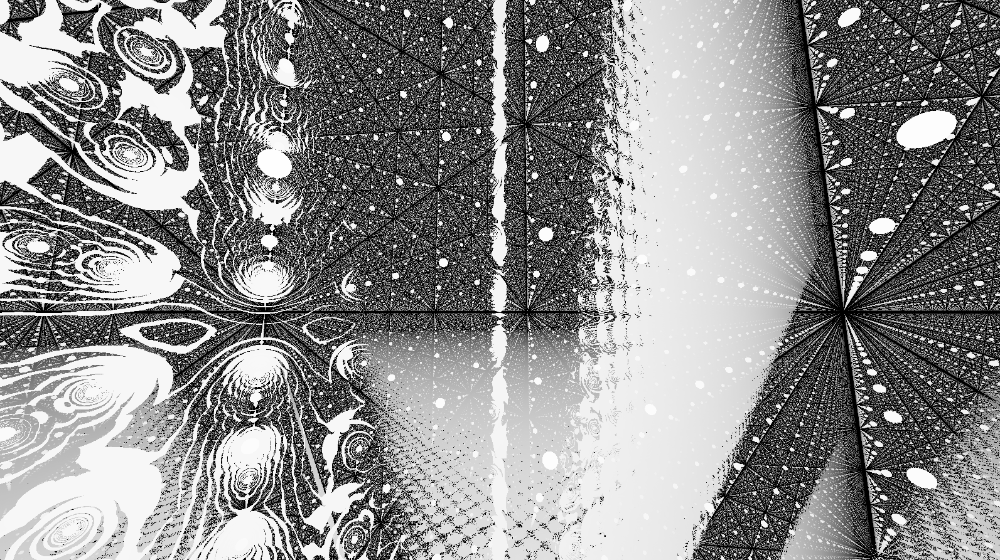
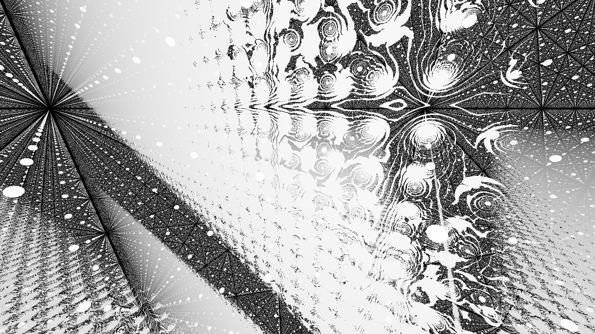

# My collection of C++ projects

## Build
To actually be able to use build.sh, you need to install sfml 2.5, the package name may vary, but make sure to install SFML version 2.5
Then you can use build.sh as follows:
```cd Project-you-want```
```../build.sh main.cpp <binaryname>```
To later be able to execute the freshly built binaries, you need to do the following:
```export LD_LIBRARY_PATH=/opt/sfml2/lib:$LD_LIBRARY_PATH```
This is assuming /opt/sfml2/lib is actually the right directory.

## List of projects

### Black hole



### Circle physics

### Game-of-life



### Gravity-simulation

### Mandelbrot-set



### Minesweeper

### Particle-life



### Pendulum-sim


### Polynomials



### probability-sim



### Raymarching




### SFML-test

### Softbody-physics
